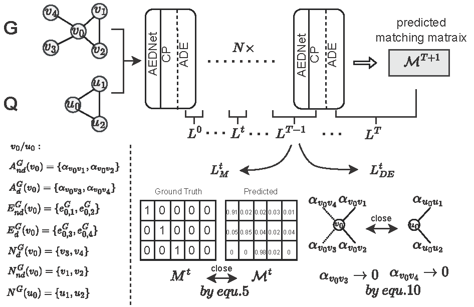

[comment]: <> (>📋  A template README.md for code accompanying a Machine Learning paper)

# AEDNet: Adaptive Edge-Deleting Network For Subgraph Matching

This repository is the official implementation of ['AEDNet: Adaptive Edge-Deleting Network For Subgraph Matching'](https://doi.org/10.1016/j.patcog.2022.109033).

[Official Download: Here](https://doi.org/10.1016/j.patcog.2022.109033) can download official paper. 

[Free Download: Here](https://arxiv.org/pdf/2211.04033) can download paper. 



[Official Download: Here](https://doi.org/10.1016/j.patcog.2022.109033) can download official paper. 

[Free Download: Here](https://arxiv.org/pdf/2211.04033) can download paper. 


## Requirements
>* python3.7
>* pytorch==1.9.0
>* dgl==0.8.0
>* networkx==2.6.2
>* numpy==1.21.5
>* matplotlib==3.4.2

This code repository is heavily built on [DGL](https://www.dgl.ai/), which is a DEEP GRAPH LIBRARY for Graph Computation. Please refer [here](https://docs.dgl.ai/index.html#) for how to install and utilize the library.


## Datasets

#### Generate Data
There are some samples in './data/'. You should generate data before training.

To generate the Synthetic Data, run this command:
```train
python creatData.py
```
#### Processing Data
You can use dgraph.__getitem __() in dataSet.py to process one sample and then use collate() in dataSet.py to batch data.
#### See one data sample'interior structure
You can use this command to see one data sample's interior structure.
```train
from dgl.data.utils import save_graphs, get_download_dir, load_graphs

graph_pair_path = './data/COX2/train/0.bin'  ## one data sample's path
graph_pair, label_dict = load_graphs(graph_pair_path)
graph_data = graph_pair[0]  ##  one sample's data graph in DGL form
graph_query = graph_pair[1]  ##  one sample's query graph in DGL form
label = label_dict['glabel']  ##  Ground-Truth matching relatinship
print(graph_data, graph_query, label)
```


## Training

To train the model(s) in the paper, run this command:

```train
python train.py
```
# Reference
If you find our paper/code is useful, please consider citing our paper:

```
@article{lan2023aednet,
  title={AEDNet: Adaptive Edge-Deleting Network For Subgraph Matching},
  author={Lan, Zixun and Ma, Ye and Yu, Limin and Yuan, Linglong and Ma, Fei},
  journal={Pattern Recognition},
  volume={133},
  pages={109033},
  year={2023},
  publisher={Elsevier}
}
```

